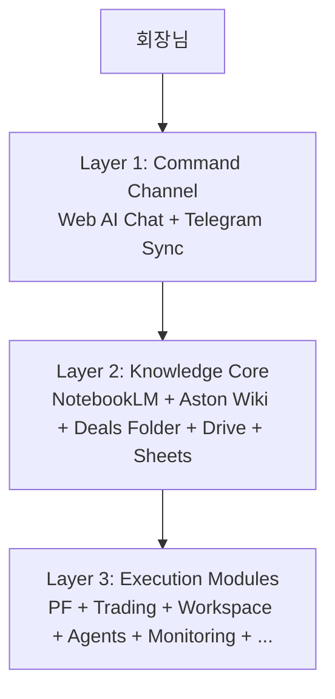
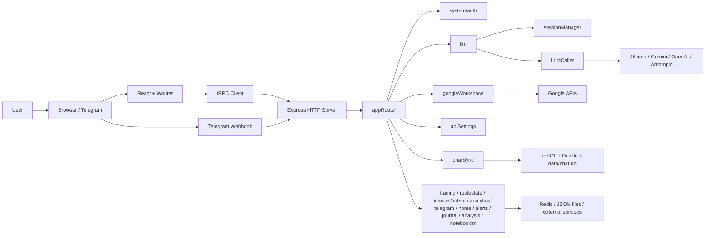
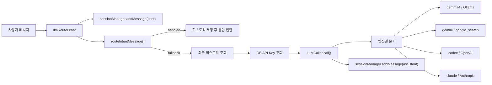
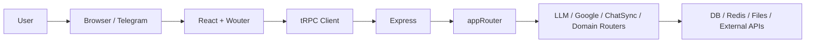
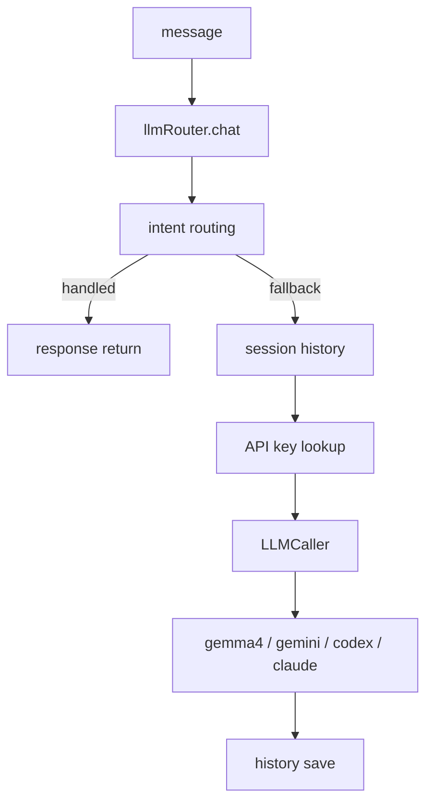
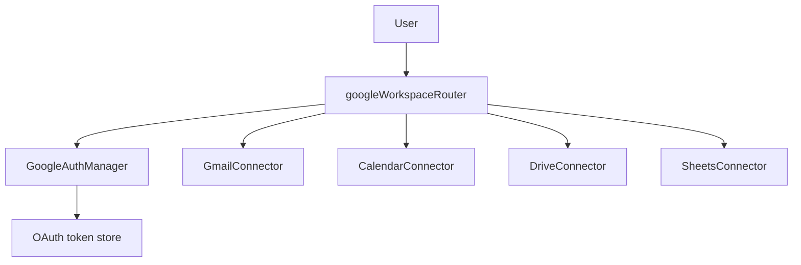
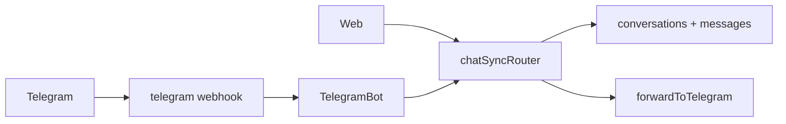
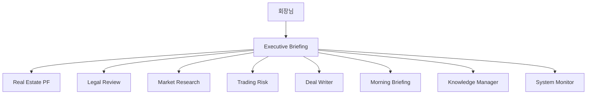

# Aston Workstation Architecture

## 1. 문서 개요

- 작성일: 2026-05-02
- 작성 목적: `astonchoi-spec/GoogleAI`의 현재 기술 구조를 회장님과 외부 AI/개발자가 빠르게 파악할 수 있도록 정리
- 갱신 주기: 주요 라우팅/인프라/연동 구조 변경 시, 그리고 `master` 머지 직후
- 대상 독자: 회장님, 외부 AI 에이전트, 신규 개발자

---

## 2. 앱 중심축 — 3계층 구조

`Aston Workstation`의 중심축은 개별 메뉴나 개별 직원이 아니라 `AI 채팅`이다. 모든 업무는 `1계층 Command Channel`에서 시작되고, `2계층 Knowledge Core`에서 근거를 찾은 뒤, `3계층 Execution Modules`가 실제 작업을 처리한다.

### 1계층 `Command Channel` (`관제탑`)

- `Web AI Chat`
- `Telegram Chat Sync`
- `Quick Command Buttons`
- `Natural Language Intent Routing`

### 2계층 `Knowledge Core` (`두뇌·기억`)

- `NotebookLM`
- `Aston Wiki` (`G:\Aston-Wiki\`)
- `Aston-Deals Folder` (`G:\Aston-Deals\`)
- `Google Drive`
- `Google Sheets`

### 3계층 `Execution Modules` (`손발`)

- `Real Estate PF`
- `Trading`
- `Google Workspace`
- `Agent Control`
- `Monitoring`
- `Mail Writing`
- `Calendar Creation`
- `Position Check`
- `Employee Agents` (`PF 분석`, `법률 검토`, `시장 조사`, `트레이딩 검토`, `자료 비서`, `모닝 브리핑`, `기록 관리`)

원칙: 모든 업무는 `1계층`(`AI 채팅`)을 통해 시작되고, `2계층`(`지식 코어`)에서 근거를 찾아, `3계층`(`실행 모듈`)이 처리한다. 직원이나 세부 기능 구현보다 `1·2계층` 안정화가 우선한다.



---

## 3. 앱 정체성

- 레포명: `astonchoi-spec/GoogleAI`
- 지향: Aston Workstation, 회장님 전용 AI 업무 관제탑
- 한 줄 정의: React/Vite 프론트엔드 + Express/tRPC 서버 + Multi-LLM + Google Workspace + Telegram Bot + SQLite/libSQL 대화 DB
- 기본 브랜치: `master`
- 현재 작업 브랜치: `codex-google-workspace-expansion`

---

## 4. 전체 시스템 구조



현재 서버 진입점은 `server/_core/index.ts`이고, 브라우저는 `client/src/App.tsx`에서 Wouter 라우팅으로 화면을 전환한다. 프론트는 대부분 tRPC로 서버에 접근하고, Telegram은 `/api/webhooks/telegram`으로 직접 유입된다. 서버 내부에서는 `appRouter`가 도메인 라우터를 묶고, 각 라우터가 DB, Google APIs, LLM provider, Telegram, Redis, 파일 시스템으로 분기한다.

---

## 5. 프론트엔드 구조

- 핵심 파일: `client/src/App.tsx`
- 실제 래핑 순서: `ErrorBoundary` → `ThemeProvider` → `TooltipProvider` → `Toaster` + `GlobalToastBridge` → `Router`
- 셸 구조: `client/src/components/layout/AppShell.tsx`가 `Sidebar`와 `StatusBar`를 감싼다

### 실제 라우트 현황

`client/src/App.tsx` 기준 실제 등록 라우트는 4개가 아니다.

| 경로 | 컴포넌트 |
|---|---|
| `/` | `Home` |
| `/chat` | `Chat` |
| `/trading` | `TradingPage` |
| `/real-estate-pf` | `RealEstatePage` |
| `/google` | `Google` |
| `/settings` | `Settings` |
| `/notebook-lm` | `NotebookLMPage` |
| `/wiki` | `WikiPage` |
| `/agents` | `AgentControl` |
| `/monitoring` | `Monitoring` |
| `/login` | `Login` |
| `/404` | `NotFound` |
| fallback | `NotFound` |

즉, 요청서의 "실제 라우트 4개"는 현재 코드와 불일치한다. 현재 구현은 최소 12개 명시 라우트 + fallback 1개다.

### Home 페이지 실제 구성

현재 `/`는 섹션형 랜딩 조합이 아니라 `client/src/pages/Home.tsx` 단일 페이지다. 실제 렌더링 블록은 다음 순서다.

1. 히어로 배너
2. AI 명령 입력 박스
3. KPI 카드 그리드
4. 주요 모듈 카드
5. 최근 활동
6. 운영 메모
7. `WorkspaceWidgets`

### 레거시 섹션 컴포넌트 현황

요청서에 명시된 `Sidebar`, `HeroSection`, `OverviewSection`, `ArchitectureSection`, `FeaturesSection`, `TechStackSection`, `ConversationFlowSection`, `SecuritySection`, `RoadmapSection`, `CodeExamplesSection`, `APIReferenceSection`, `FooterSection` 파일은 `client/src/components/`에 모두 존재한다. 다만 현재 `Home.tsx`는 이 섹션들을 조합하지 않는다. 즉, 파일은 남아 있지만 현재 홈 라우트의 실제 구성 요소는 아니다.

### 사이드바 13개 메뉴와 실제 연결

`client/src/components/Sidebar.tsx` 기준 사이드바 메뉴는 정확히 13개다.

1. 홈
2. AI 채팅
3. 트레이딩
4. 부동산 PF
5. Google Workspace
6. 노트북LM
7. 에스턴 위키
8. Agent Control
9. 모니터링
10. 메일 작성
11. 일정 만들기
12. 포지션 확인
13. 설정

격차는 두 종류다.

- 메뉴 수와 라우트 수가 13 대 12+fallback로 일치하지 않는다.
- `메일 작성`, `일정 만들기`, `포지션 확인`은 독립 페이지가 아니라 각각 `/google?tab=gmail`, `/google?tab=calendar`, `/trading`으로 연결되는 바로가기다.

---

## 6. 서버 구조

- 핵심 파일: `server/_core/index.ts`
- 역할 요약
  - Express 앱 생성
  - HTTP 서버 생성
  - `express.json` / `express.urlencoded` 50MB 설정
  - `registerStorageProxy`
  - `registerOAuthRoutes`
  - `registerProxyRoutes`
  - `registerTradingRiskRoutes`
  - `registerAgentRoutes`
  - `/api/webhooks`에 Telegram / Google callback 등록
  - `/api/trpc`에 `appRouter` 연결
  - 개발 시 Vite, 운영 시 정적 파일 서빙
  - `findAvailablePort()`로 포트 자동 탐색
  - `initializeTelegramBot()` 실행
  - `registerMorningBriefingScheduler()` 등록
  - `registerDealSheetSyncScheduler()` 등록
  - 카카오/Gmail/다운로드 watcher 시작
  - `SIGINT` / `SIGTERM` graceful shutdown

보조적으로 `probeOpenClaw()`, `setAgentNotifier()`, `autoMergeTelegramConversations()`도 부팅 시 호출된다.

---

## 7. tRPC 라우터 구조

- 핵심 파일: `server/routers.ts`

### 핵심 축

- `system`
- `auth`
- `llm`
- `googleWorkspace`
- `apiSettings`
- `chatSync`

### 실제 추가 등록 라우터

현재 `appRouter`는 위 6개 외에도 다음을 포함한다.

- `trading`
- `realestate`
- `finance`
- `intent`
- `analytics`
- `telegram`
- `home`
- `alerts`
- `journal`
- `analysis`
- `notebooklm`

### auth 라우터

- `me`
- `login`
- `logout`

보안 경고:

- `server/routers.ts`에 `ADMIN_USERNAME = "admin"`과 `ADMIN_PASSWORD = "admin123"`가 하드코딩되어 있다.
- 현 상태는 개발용 편의 수준이며 운영용 인증으로 볼 수 없다.

---

## 8. LLM 구조

- 핵심 파일
  - `server/routers/llm.ts`
  - `server/llm/caller.ts`
  - `server/llm/session.ts`
  - `server/llm/models.ts`

### `llmRouter` 기능

- `getStatus`
- `getEngines`
- `getModels`
- `switchEngine`
- `switchModel`
- `switchEngineAndModel`
- `chat`
- `getHistory`
- `clearHistory`

### 호출 흐름



### 지원 엔진 4종

| 엔진 | 구현 |
|---|---|
| `gemma4` | Ollama 로컬 호출, 실패 시 Gemini fallback |
| `gemini` | Google Generative Language REST 호출, `google_search` grounding 사용 가능 |
| `codex` | OpenAI Chat Completions 호출 |
| `claude` | Anthropic Messages API 호출 |

### 모델 레지스트리

`server/llm/models.ts`는 각 엔진별 모델 키와 기본 모델을 관리한다. 기본 엔진/모델은 `LLM_PROVIDER`, `LLM_MODEL_KEY` 환경변수로 재정의 가능하다.

### 시스템 프롬프트 현황

현재 시스템 프롬프트는 `server/routers/llm.ts` 안에 인라인 문자열로 들어 있으며 "에스턴 워크스테이션의 업무형 AI 비서" 정도의 범용 지시다. 직원 조직, 역할 분담, 승인 체계, Aston 전용 판단 포맷까지 반영된 프롬프트는 아직 아니다. 향후 Aston Workstation 전환 시 에이전트 역할별 시스템 프롬프트 체계로 재구성할 필요가 있다.

---

## 9. Google Workspace 구조

- 핵심 파일: `server/routers/google-workspace.ts`
- 연결 클래스
  - `GoogleAuthManager`
  - `GmailConnector`
  - `CalendarConnector`
  - `DriveConnector`
  - `SheetsConnector`

### OAuth 환경변수

- `GOOGLE_CLIENT_ID`
- `GOOGLE_CLIENT_SECRET`
- `GOOGLE_REDIRECT_URI`

### 흐름

```mermaid
flowchart LR
    UI["Web / tRPC Client"] --> GW["`googleWorkspaceRouter`"]
    GW --> AUTH["`GoogleAuthManager`"]
    AUTH --> TOK["`sessionManager` + `data/google-tokens.json`"]
    GW --> GM["`GmailConnector`"]
    GW --> GC["`CalendarConnector`"]
    GW --> GD["`DriveConnector`"]
    GW --> GS["`SheetsConnector`"]
    GM --> Gmail["Gmail API"]
    GC --> Calendar["Google Calendar API"]
    GD --> Drive["Google Drive API"]
    GS --> Sheets["Google Sheets API"]
```

### 라우터 기능 표

| 영역 | 메서드 |
|---|---|
| Auth | `getAuthUrl`, `exchangeCode`, `isAuthenticated`, `revokeAuth` |
| Gmail | `getEmails`, `sendEmail`, `markAsRead`, `deleteEmail` |
| Calendar | `getUpcomingEvents`, `createEvent`, `getMonthEvents`, `deleteEvent` |
| Drive | `listFolder`, `searchFiles`, `createFolder`, `deleteFile`, `shareFile`, `uploadFile` |
| Sheets | `getDefaultSpreadsheet`, `connectDefaultSpreadsheet`, `readSheet`, `writeSheet`, `appendSheet`, `createSpreadsheet` |

---

## 10. API Key Settings 구조

- 핵심 파일
  - `server/routers/api-settings.ts`
  - `server/db.ts`

### 지원 Provider

- `gemini`
- `openai`
- `anthropic`
- `ollama`

### 기능

- `getAll`
- `save`
- `delete`
- `validate`

### 보안 구조

- 프론트로는 실제 키 대신 `hasKey`만 반환
- 저장 전 `encrypt()`, 읽기 시 `decrypt()`
- 모든 라우트는 `protectedProcedure`

---

## 11. DB 구조

- 핵심 파일
  - `server/db.ts`
  - `server/db-chat.ts`
  - `drizzle/schema.ts`
- DB 경로
  - 실제 접속 URL: `file:${path.resolve("./data/chat.db")}`
  - 파일 위치: `./data/chat.db`
- 구현
  - `@libsql/client`
  - Drizzle ORM

### 테이블 4개

| 테이블 | 용도 |
|---|---|
| `users` | 로그인 사용자 기본 정보 |
| `apiSettings` | 사용자별 LLM/API 키 저장 |
| `conversations` | 대화 세션, Telegram chat 연결, pinned 상태 |
| `messages` | 웹/텔레그램 메시지 본문과 메타데이터 |

### 함수 목록

`server/db.ts`

- `getDb`
- `upsertUser`
- `getUserByOpenId`
- `saveApiSetting`
- `getApiSettings`
- `getApiSetting`
- `getDecryptedApiSettings`
- `deleteApiSetting`

`server/db-chat.ts`

- `getOrCreateConversation`
- `getOrCreateTelegramConversation`
- `saveMessage`
- `updateMessage`
- `deleteMessage`
- `clearConversationMessages`
- `getConversationMessages`
- `getConversationMessagesAsc`
- `getRecentMessages`
- `searchConversationMessages`
- `getConversationByTelegramChatId`
- `updateConversationTitle`
- `updateConversationPinned`
- `getPinnedConversations`
- `getConversationById`
- `mergeTelegramConversationIntoUser`
- `autoMergeTelegramConversations`

---

## 12. Chat Sync / Telegram 구조

- 핵심 파일
  - `server/routers/chat-sync.ts`
  - `server/webhooks/telegram.ts`
  - `server/telegram-service.ts`
  - 실제 Telegram bot 구현 진입은 `server/llm/telegram-bot.ts` re-export → `server/llm/telegramBot/`

### `chatSyncRouter` 기능

- `getConversation`
- `getMessages`
- `getRecentMessages`
- `searchMessages`
- `saveWebMessage`
- `saveTelegramMessage`
- `updateTitle`
- `togglePinned`
- `getPinnedConversations`
- `exportConversation`
- `deleteMessage`
- `clearConversation`
- `editMessage`
- `linkTelegramChat`
- `getConversationByTelegramId`
- `forwardToTelegram`

### 동기화 흐름

```mermaid
flowchart LR
    WEB["Web Chat"] --> CS["`chatSyncRouter.saveWebMessage`"]
    TG["Telegram Update"] --> WH["`/api/webhooks/telegram`"]
    WH --> BOT["TelegramBot"]
    BOT --> CS2["DB save + intent/LLM 처리"]
    CS --> DB["`conversations` / `messages`"]
    CS2 --> DB
    DB --> FE["`getMessages` / `getRecentMessages`"]
    FE --> WEB
    WEB --> FWD["`forwardToTelegram`"]
    FWD --> TS["`telegram-service.ts`"]
    TS --> TG2["Telegram sendMessage"]
```

### 개선 포인트

- `getMessages` 내부에 ownership check TODO가 남아 있음
- `saveTelegramMessage`는 공개 프로시저라 추가 권한 검증 여지가 있음
- Telegram 전달 실패 시 현재는 경고 수준 처리라 재시도/추적 체계가 약함

---

## 13. 도메인 모듈

### `server/agents/`

| 파일 | 줄 수 |
|---|---:|
| `server/agents/index.ts` | 88 |
| `server/agents/openclawClient.ts` | 526 |
| `server/agents/agentResultLoader.ts` | 115 |
| `server/agents/agentBriefing.ts` | 86 |

주요 책임:

- Agent queue 단일 진입점
- OpenClaw 연결, 탐지, 런타임 상태 처리
- 전일 에이전트 결과 로드
- 모닝브리핑용 에이전트 요약 생성

### `server/deals/`

| 파일 | 줄 수 |
|---|---:|
| `server/deals/index.ts` | 11 |
| `server/deals/dealFileRouter.ts` | 163 |
| `server/deals/dealSheetSync.ts` | 119 |

주요 책임:

- Deal Folder 명령 라우팅
- 파일 저장/분류
- Google Sheets 동기화
- watcher 연계

### `server/intent/`

| 파일 | 줄 수 |
|---|---:|
| `server/intent/intentService.ts` | 227 |

주요 책임:

- Telegram/웹 자연어 인텐트 라우팅
- 도메인 핸들러 연결
- 확인 필요 액션 분기

### `server/intelligence/`

| 파일 | 줄 수 |
|---|---:|
| `server/intelligence/briefing.ts` | 366 |

현재 실제 파일은 `briefing.ts`와 `README.md`뿐이다. 요청서의 `RiskGuard`는 이 디렉터리에 없다.

### `RiskGuard` 실제 위치

| 파일 | 줄 수 |
|---|---:|
| `server/trading/riskGuard.ts` | 248 |

### `server/_core/` 추가분

| 파일 | 줄 수 |
|---|---:|
| `server/_core/googleSheets.ts` | 167 |
| `server/_core/briefingSources.ts` | 479 |
| `server/_core/agentNotifier.ts` | 91 |

---

## 14. 외부 연동 현황

| 연동 | 상태 | 근거 |
|---|---|---|
| Telegram Bot | ✅ | `server/webhooks/telegram.ts`, `server/telegram-service.ts`, `server/routers/telegram.ts` 존재 |
| Google OAuth | ✅ | `server/google/auth.ts`, `googleWorkspaceRouter` 구현 |
| Gmail | ✅ | `GmailConnector` + Gmail router 구현 |
| Calendar | ✅ | `CalendarConnector` + Calendar router 구현 |
| Drive | ✅ | `DriveConnector` + Drive router 구현 |
| Sheets | ✅ | `SheetsConnector` + `dealSheetSync` 구현 |
| OpenClaw | ⚠️ | 코드 연동 존재, 최근 `HANDOFF.md` 기준 health/smoke 불안정 |
| Gemini | ✅ | `LLMCaller.callGemini()` 구현 |
| OpenAI | ✅ | `LLMCaller.callCodex()` 구현 |
| Anthropic | ✅ | `LLMCaller.callClaude()` 구현 |
| Ollama | ✅ | `LLMCaller.callGemma4()` 구현 |
| NotebookLM | ⚠️ | `server/routers/notebooklm.ts`와 MCP env 존재, 기본값은 `NOTEBOOKLM_MCP_ENABLED=false` |
| Binance | ✅ | trading/public data 및 exchange connector 사용 경로 존재 |
| Upbit | ✅ | 잔고/주문/가격 경로 존재 |
| TradingView | ✅ | `registerTvWebhookRoutes()`와 alerts 저장 경로 존재 |

주의: 이 표의 ✅는 "코드 통합 존재"를 뜻한다. 운영 검증 완료와 동일 의미는 아니다.

---

## 15. 운영 트리거

- 06:30 모닝브리핑: `registerMorningBriefingScheduler()`
- 06:30 Sheets 동기화: `registerDealSheetSyncScheduler()`
- 상시 폴더 감시 3종
  - `startKakaoFolderWatcher()`
  - `startGmailWatcher()`
  - `startDownloadWatcher()`
- 딜 변경 시 즉시 동기화: `dealStore` 변경 후 fire-and-forget sync 경로
- OpenClaw 재탐지: 부팅 probe + 탐지 스크립트/런타임 재시도 경로
- 에이전트 타임아웃: `OPENCLAW_REQUEST_TIMEOUT_MS`, `AGENT_APPROVAL_TIMEOUT_MIN`, queue timeout 로직

---

## 16. 지식 저장소 경로

- `./data/chat.db`
- `data/google-sheets.json`
- `data/google-tokens.json`
- `data/openclaw-discovery.json`
- `data/openclaw-smoke.json`
- `data/risk-state.json`
- `data/workspace-sheet.json`
- `G:\Aston-Wiki\` 계열
  - 코드/예시 기준 실제 env 키: `WIKI_ROOT`
- `G:\Aston-Deals\` 계열
  - 코드/예시 기준 실제 env 키: `DEALS_ROOT`

요청서의 "data/*.json 4개"와 달리 현재 저장 JSON 파일은 최소 6개다.

---

## 17. 환경 변수 전체

### Telegram

- `TELEGRAM_BOT_TOKEN`
- `OWNER_TELEGRAM_CHAT_ID`
- `TV_WEBHOOK_TELEGRAM_CHAT_ID`

### Google OAuth / Workspace

- `GOOGLE_CLIENT_ID`
- `GOOGLE_CLIENT_SECRET`
- `GOOGLE_REDIRECT_URI`
- `WORKSPACE_SPREADSHEET_ID`
- `WORKSPACE_SPREADSHEET_TITLE`
- `WORKSPACE_SHEET_TITLE`
- `GMAIL_ENABLED`
- `GMAIL_AUTO_LABEL`
- `GMAIL_POLL_INTERVAL_MIN`
- `GOOGLE_SHEETS_ENABLED`
- `GOOGLE_SHEETS_SYNC_HOUR`
- `GOOGLE_SHEETS_SYNC_MINUTE`
- `GOOGLE_SHEETS_USER_ID`

### LLM Keys / Providers

- `GEMINI_API_KEY`
- `OPENAI_API_KEY`
- `ANTHROPIC_API_KEY`
- `OLLAMA_HOST`
- `OPENAI_BASE_URL`
- `OPENROUTER_API_KEY`
- `OPENROUTER_BASE_URL`
- `LLM_ADAPTER`
- `LLM_PROVIDER`
- `LLM_MODEL_KEY`
- `GEMINI_GROUNDING_ENABLED`

### OpenClaw / Agent

- `OPENCLAW_AUTO_DETECT`
- `OPENCLAW_API_URL`
- `OPENCLAW_API_KEY`
- `OPENCLAW_PROBE_TIMEOUT_MS`
- `OPENCLAW_REQUEST_TIMEOUT_MS`
- `OPENCLAW_DEFAULT_MODEL`
- `AGENT_APPROVAL_TIMEOUT_MIN`
- `AGENT_PERMISSION_LEVEL`
- `AGENT_WIKI_PATH`

### Google Sheets / Knowledge Roots / Watchers

- `WIKI_ROOT`
- `DEALS_ROOT`
- `KAKAO_DOWNLOAD_PATH`
- `DOWNLOAD_WATCH_PATH`

### Trading / Exchange / TradingView

- `GATE_API_KEY`
- `GATE_SECRET`
- `BINANCE_API_KEY`
- `BINANCE_SECRET`
- `UPBIT_API_KEY`
- `UPBIT_SECRET`
- `BYBIT_API_KEY`
- `BYBIT_SECRET`
- `GATEIO_API_KEY`
- `GATEIO_API_SECRET`
- `TV_WEBHOOK_SECRET`
- `UPBIT_WS_SYMBOLS`
- `ENABLE_REAL_ORDERS`
- `MAX_ORDER_KRW`
- `MAX_DAILY_AUTO_TRADES`
- `APPROVAL_TIMEOUT_MS`

### Server / DB / Infra

- `NODE_ENV`
- `PORT`
- `LOG_LEVEL`
- `REDIS_URL`
- `REDIS_FALLBACK`
- `DATABASE_URL`
- `JWT_SECRET`

### 기타 연동

- `DATA_GO_KR_API_KEY`
- `PUBLIC_DATA_API_KEY`
- `DART_API_KEY`
- `NOTEBOOKLM_MCP_ENABLED`
- `NOTEBOOKLM_MCP_URL`
- `BUILT_IN_FORGE_API_URL`
- `BUILT_IN_FORGE_API_KEY`
- `HERMES_API_KEY`
- `HERMES_BASE_URL`
- `KIWOOM_*`

---

## 18. Security Notes

- `admin/admin123` 하드코딩 로그인 제거 필요
- `protectedProcedure` 적용 범위 재점검 필요
- API Key 값은 로그에 출력하지 않도록 유지해야 함
- 토큰 파일과 `.env`는 절대 커밋 금지
- OpenClaw 미탐지 또는 인증 불명확 상태에서 내부 Gemini 직접 호출로 우회 자동화하지 말아야 함

---

## 19. Known Weaknesses

- `README.md`가 구조 문서 역할을 충분히 하지 못함
- 현재 제품 인상은 Google↔Telegram 데모 성격이 강하고 Aston 운영체제 정체성이 약함
- 사이드바 13개 메뉴와 실제 라우팅/기능 대응이 완전히 정렬되어 있지 않음
- Drive 기반 RAG/검색 체계가 약함
- 업무 도메인별 모듈은 일부만 깊게 구현됨
- 시스템 프롬프트가 아직 범용 비서 수준
- 에이전트 라우팅과 역할 분담이 초기 단계

---

## 20. Aston Workstation 확장 방향

### 직원 7명 조직 구상

1. PF 분석
2. 법률 검토
3. 시장 조사
4. 트레이딩 검토
5. 딜 자료 비서
6. 모닝브리핑
7. 기록관리

### Agent Layer 9종

1. Executive Briefing
2. Real Estate PF
3. Deal Review
4. Finance Trading Risk
5. Google Workspace
6. Drive Wiki Research
7. Telegram Command
8. Report Writer
9. System Monitor

### 운영 원칙 7개

1. OpenClaw 단일 실행 레이어 유지
2. 직원별 템플릿 분리
3. 결과는 Markdown 저장 우선
4. 불필요한 요약 금지
5. 결론, 숫자, 판단, 액션 필수
6. 승인제 유지
7. 검증된 자동화만 승격

직원 구현은 `1·2계층` 안정화 이후 진행한다. `1·2계층`이 작동하지 않는 상태에서 `3계층` 직원만 만들면 입력·출력 경로가 끊긴 직원이 된다.

### Phase 로드맵

- Phase 1: 현재 Google/Telegram/Chat/DB 안정화
- Phase 2: Deal Folder, watchers, briefing, sheets 운영화
- Phase 3: Agent Control과 OpenClaw 실연동 안정화
- Phase 4: Aston 전용 시스템 프롬프트와 역할별 템플릿 정립
- Phase 5: 회장님 업무 도메인별 에이전트 조직화와 운영 자동화

---

## 21. Mermaid 다이어그램 모음

### 20-1. 전체 시스템 구조도



### 20-2. LLM 호출 흐름도



### 20-3. Google Workspace 흐름도



### 20-4. Chat Sync 흐름도



### 20-5. Aston 전환 후 직원 조직도



---

이 문서는 코드 변경 없이 작성되었으며, `3계층 구조 반영` 상태로 유지된다. 다음 갱신 시점은 `master` 브랜치 머지 직후다.
